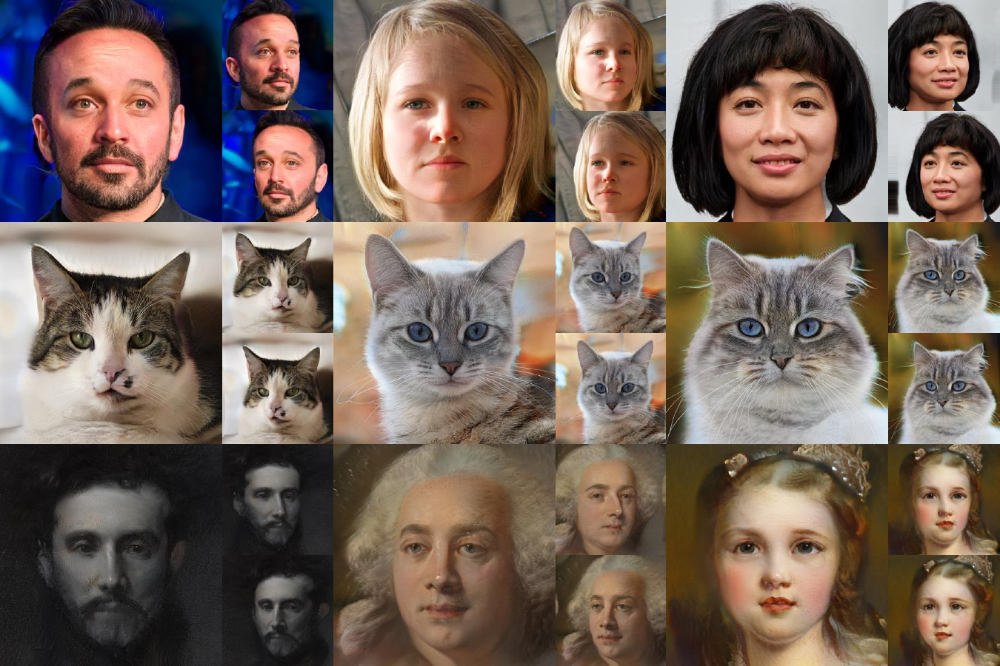

<h1 align="center">Generative Multiplane Neural Radiance (GMNR)</h1>

for 3D-Aware Image Generation

  

**Generative Multiplane Neural Radiance for 3D-Aware Image Generation.** 
[Amandeep Kumar](https://virobo-15.github.io/), [Ankan Kumar Bhunia] (https://ankanbhunia.github.io/), [Sanath Narayan](https://sites.google.com/view/sanath-narayan/home), [Hisham Cholakkal](https://scholar.google.com/citations?user=bZ3YBRcAAAAJ&hl=en), [Rao Muhammad Anwer](https://scholar.google.fi/citations?user=_KlvMVoAAAAJ&hl=en), [Salman Khan](https://scholar.google.com.pk/citations?user=M59O9lkAAAAJ&hl=en), [Ming-Hsuan Yang](https://scholar.google.com/citations?user=p9-ohHsAAAAJ&hl=en), [Fahad Shahbaz Khan](https://scholar.google.com/citations?user=zvaeYnUAAAAJ&hl=en)

###  [Paper]()
